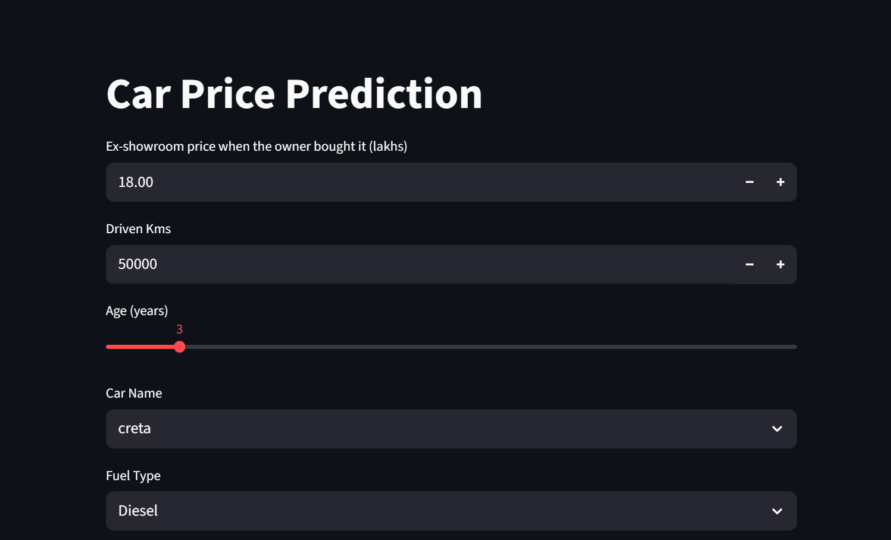
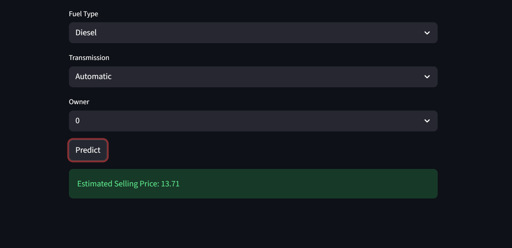

# Car Price Prediction

A Machine Learning web application that predicts the selling price of used cars based on vehicle attributes such as present price, age, fuel type, transmission type, ownership history, and kilometers driven.

## Live Demo

**Try the application here:**

https://car-price-prediction-app-de4o3xhleqgibhei2qccag.streamlit.app/

---

## Features

- Predicts used car selling prices instantly
- Interactive Streamlit web interface
- Automated data preprocessing
- Machine Learning model pipeline using Scikit-Learn
- Supports multiple vehicle attributes for prediction
- End-to-end ML workflow from training to deployment

---

## Technologies Used

- Python
- Pandas
- NumPy
- Scikit-Learn
- Streamlit
- Joblib
- Jupyter Notebook

---

## Project Structure

```text
CAR_PRICE_PROJECT_USER/
│
├── Screenshots/
│   ├── Streamlit.png
│   └── Streamlit_app.png
│
├── app_user.py
├── train_model.py
├── car_data.csv
├── model_performance.csv
├── car_price_model_user.joblib
├── Car_Price_Prediction_User.ipynb
├── requirements.txt
├── README.md
└── .gitignore
```

---

## Dataset Features

The model uses the following vehicle attributes:

- Car_Name
- Present_Price
- Driven_kms
- Fuel_Type
- Transmission
- Owner
- Age

Target Variable:

- Selling_Price

---

## Model Performance

| Model                       | MAE    | RMSE   | R² Score |
| --------------------------- | ------ | ------ | -------- |
| Random Forest Regressor     | 0.6117 | 0.9337 | 0.9622   |
| Gradient Boosting Regressor | 0.5558 | 0.9333 | 0.9622   |

### Best Model

**Gradient Boosting Regressor**

- MAE: 0.5558
- RMSE: 0.9333
- R² Score: 0.9622

The final deployed model achieved an **R² Score of 96.22%**, indicating strong predictive performance on unseen data.

---

## Installation

### 1. Clone the Repository

```bash
git clone https://github.com/SamyakkSingh/CAR_PRICE_PROJECT_USER.git
cd CAR_PRICE_PROJECT_USER
```

### 2. Create Virtual Environment

#### Windows

```bash
python -m venv venv
venv\Scripts\activate
```

#### Linux / macOS

```bash
python3 -m venv venv
source venv/bin/activate
```

### 3. Install Dependencies

```bash
pip install -r requirements.txt
```

---

## Train the Model

To retrain the model:

```bash
python train_model.py
```

This generates:

```text
car_price_model_user.joblib
```

---

## Run the Streamlit Application

```bash
streamlit run app_user.py
```

After running the command, open the local URL displayed in the terminal (typically http://localhost:8501).

---

## Application Preview

### Home Page



### Prediction Result



---

## Project Objective

The objective of this project is to estimate the market value of used cars using Machine Learning techniques. The system helps users make informed buying and selling decisions by providing fast and accurate price predictions based on vehicle specifications.

---

## Author

**Samyak Singh**

GitHub: https://github.com/SamyakkSingh
